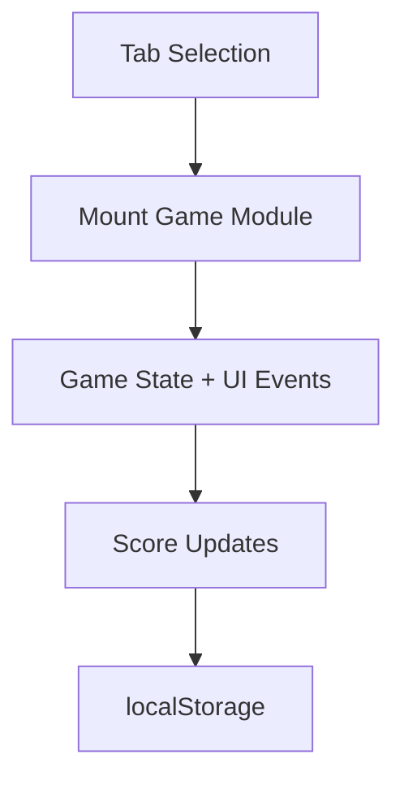

# Mini Game Hub

Portfolio-grade browser arcade featuring four interactive games, difficulty presets, persistent scores, and achievements.

## Included Games

1. **Reaction Timer**
   - Randomized start signal.
   - Early-click penalty handling.
   - Best reaction time tracking.

2. **Memory Match**
   - Pair matching with randomized board.
   - Win detection and win counter.

3. **Sequence Recall**
   - Simon-style increasing pattern challenge.
   - Best completed round tracking.

4. **Pattern Sprint**
   - 25-second reflex challenge on a 3x3 live target grid.
   - Dynamic scoring and personal best tracking.
   - Keyboard grid support on `1-9` in addition to mouse clicks.

5. **Achievements Layer**
   - Unlock milestones across all games.
   - Arcade all-rounder badge for full completion.

6. **Training Coach**
   - Reads recent runs and milestone gaps.
   - Suggests the next game to practice for balanced improvement.

9. **Milestone Board**
   - Shows the exact gap to each remaining achievement threshold.
   - Keeps the next target visible without reading the whole achievement list.

10. **Today's Drill**
   - Rotates a focused practice target by day.
   - Shows whether the current profile has already cleared the drill goal.

11. **Coverage Board**
   - Shows which games have recent reps vs neglected practice.
   - Keeps the weakest lane visible without reading the full run log.

12. **Training Plan**
   - Converts the current profile into a three-step practice queue.
   - Keeps the next score or achievement threshold visible by game.

13. **Session Challenge**
   - Turns the current profile into one focused challenge tied to the weakest lane.
   - Uses streak state and difficulty to frame the next practice target.

18. **Gauntlet Planner**
   - Converts the current profile into a four-stop cross-game training route.
   - Keeps one concrete score gate per game visible for portfolio walkthroughs.

14. **Live Scoreboard Sync**
   - Total runs, streak counters, coach panels, and run history now refresh after every logged run instead of only on personal-best updates.

15. **Consistency Forecast**
    - Converts streaks, active practice days, and weakest-lane readiness into a short cadence forecast.

19. **Recovery Drill**
    - Turns the weakest lane plus your latest run into one concrete bounce-back target.

20. **Momentum Contract**
    - Converts your streak state and weakest lane into one keep-the-streak-alive commitment.

16. **Training Brief Export**
   - Copies the current coach recommendation, training plan, milestone gap, and challenge link into one clipboard-ready note.

17. **Skill Balance Grade**
   - Compares reaction, memory, sequence, and pattern readiness so practice targets the weakest lane before chasing isolated highs.

7. **Portable Scoreboards**
   - Export browser progress as JSON.
   - Re-import scores and run history on another machine.

8. **Keyboard Play**
   - `Space` / `Enter` can start and resolve reaction trials.
   - Pattern Sprint supports a keyboard tile layout for faster replay.

## Technical Design

- `index.html`: shell layout + game tabs + scoreboard.
- `styles.css`: responsive arcade UI and reusable component styles.
- `script.js`: modular game mounts with cleanup hooks and localStorage persistence.



## Local Run

```bash
python -m http.server 8000
```

Open `http://localhost:8000`.

## Portfolio Demo Path

1. Start with Pattern Sprint because it creates visible score movement quickly.
2. Open the coach, milestone board, and coverage board after a run.
3. Change difficulty to show profile-aware recommendations.
4. Use `Copy Training Brief` as the handoff artifact.
5. Run the Gauntlet Planner once to show how the profile turns into an intentional cross-game practice route.

## GitHub Pages Compatibility

- Static-only deployment.
- No build tools required.
- Publish repository root.

## Future Improvements

- Add another game that stresses route-planning or resource tradeoffs instead of pure reaction/memory.
- Add cross-session trend charts for practice balance.
- Add high-score leaderboard export.
