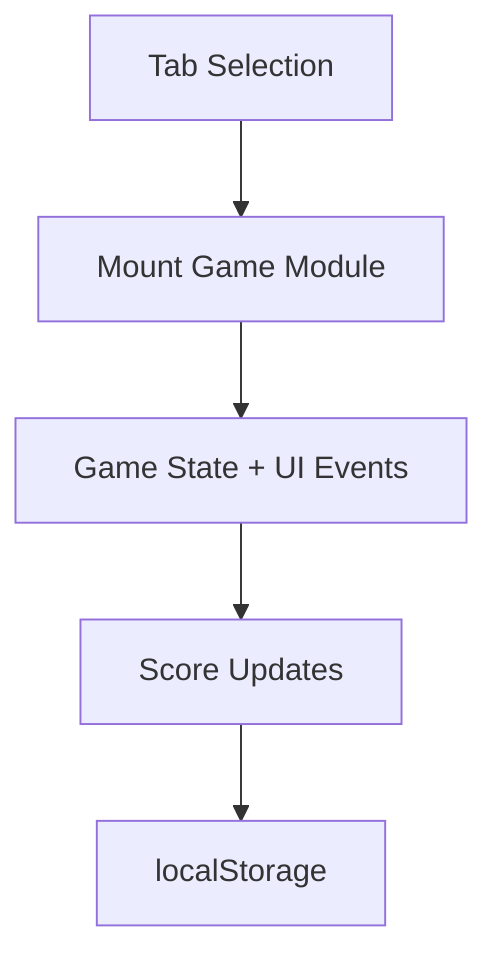

# Mini Game Hub

Portfolio-grade browser arcade featuring four interactive games, difficulty presets, persistent scores, and achievements.

## Included Games

1. **Reaction Timer**
   - Randomized start signal.
   - Early-click penalty handling.
   - Best reaction time tracking.

2. **Memory Match**
   - Pair matching with randomized board.
   - Win detection and win counter.

3. **Sequence Recall**
   - Simon-style increasing pattern challenge.
   - Best completed round tracking.

4. **Pattern Sprint**
   - 25-second reflex challenge on a 3x3 live target grid.
   - Dynamic scoring and personal best tracking.
   - Keyboard grid support on `1-9` in addition to mouse clicks.

5. **Achievements Layer**
   - Unlock milestones across all games.
   - Arcade all-rounder badge for full completion.

6. **Training Coach**
   - Reads recent runs and milestone gaps.
   - Suggests the next game to practice for balanced improvement.

7. **Portable Scoreboards**
   - Export browser progress as JSON.
   - Re-import scores and run history on another machine.

8. **Keyboard Play**
   - `Space` / `Enter` can start and resolve reaction trials.
   - Pattern Sprint supports a keyboard tile layout for faster replay.

## Technical Design

- `index.html`: shell layout + game tabs + scoreboard.
- `styles.css`: responsive arcade UI and reusable component styles.
- `script.js`: modular game mounts with cleanup hooks and localStorage persistence.



## Local Run

```bash
python -m http.server 8000
```

Open `http://localhost:8000`.

## GitHub Pages Compatibility

- Static-only deployment.
- No build tools required.
- Publish repository root.

## Future Improvements

- Add difficulty presets per game.
- Add shared achievements system.
- Add high-score leaderboard export.
