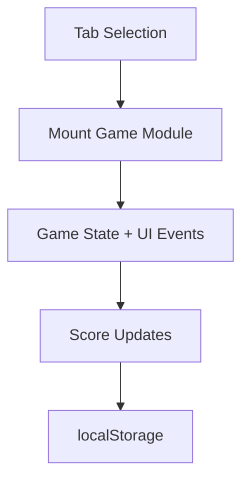

# Mini Browser Arcade

Portfolio-grade browser arcade featuring four interactive games, difficulty presets, persistent scores, and achievements.

## Included Games

1. **Reaction Timer**
   - Randomized start signal.
   - Early-click penalty handling.
   - Best reaction time tracking.

2. **Memory Match**
   - Pair matching with randomized board.
   - Win detection and win counter.

3. **Sequence Recall**
   - Simon-style increasing pattern challenge.
   - Best completed round tracking.

4. **Pattern Sprint**
   - 25-second reflex challenge on a 3x3 live target grid.
   - Dynamic scoring and personal best tracking.
   - Keyboard grid support on `1-9` in addition to mouse clicks.
   - Auto-pauses when the browser tab loses focus so background throttling does not burn the timer.

5. **Achievements Layer**
   - Unlock milestones across all games.
   - Arcade all-rounder badge for full completion.

6. **Training Coach**
   - Reads recent runs and milestone gaps.
   - Suggests the next game to practice for balanced improvement.

7. **Milestone Board**
   - Shows the exact gap to each remaining achievement threshold.
   - Keeps the next target visible without reading the whole achievement list.

8. **Achievement Route**
   - Picks the single fastest remaining achievement path from the current score profile.
   - Keeps the next move and practice warning visible without reading every milestone.
   - Keyboard shortcuts: `T` copies the current training brief and `G` copies the current gauntlet plan.

## Demo Flow

1. Play two short runs across different games.
2. Open the training coach and achievement route surfaces.
3. Export the run log or copy the training brief to show the app as a repeatable practice tracker.

## Export and handoff

- Export scores when you want a compact progression snapshot.
- Export the run log when you need detailed session history.
- Copy the training brief or gauntlet plan when you want a concise next-step recommendation instead of raw score data.

11. **Today's Drill**
   - Rotates a focused practice target by day.
   - Shows whether the current profile has already cleared the drill goal.

11. **Coverage Board**
   - Shows which games have recent reps vs neglected practice.
   - Keeps the weakest lane visible without reading the full run log.

12. **Practice Week + Radar**
   - Practice Week shows day-by-day recent reps for cadence awareness.
   - Progress Radar scores each game lane so streaks do not hide weak categories.

13. **Practice Matrix**
   - Converts current best scores into a lane-by-lane readiness matrix.
   - Makes undertrained game/difficulty combinations visible at a glance.

14. **Training Plan**
   - Converts the current profile into a three-step practice queue.
   - Keeps the next score or achievement threshold visible by game.

15. **Session Challenge**
   - Turns the current profile into one focused challenge tied to the weakest lane.
   - Uses streak state and difficulty to frame the next practice target.

16. **Portfolio Handoff**
   - Converts the current score profile into a strongest-lane, weakest-lane, and recent-route summary before sharing the arcade as a portfolio artifact.

18. **Gauntlet Planner**
   - Converts the current profile into a four-stop cross-game training route.
   - Keeps one concrete score gate per game visible for portfolio walkthroughs.

19. **Session Route**
   - Turns the gauntlet into a live four-stop practice route with one active step at a time.
   - Moves the current tab to the next recommended game so the coaching layer becomes an actual session workflow.

14. **Live Scoreboard Sync**
   - Total runs, streak counters, coach panels, and run history now refresh after every logged run instead of only on personal-best updates.

15. **Consistency Forecast**
    - Converts streaks, active practice days, and weakest-lane readiness into a short cadence forecast.

19. **Recovery Drill**
    - Turns the weakest lane plus your latest run into one concrete bounce-back target.

20. **Momentum Contract**
    - Converts your streak state and weakest lane into one keep-the-streak-alive commitment.

21. **Cross-Training Pair**
   - Pairs the weakest lane with the strongest lane so one session can widen the profile before consolidating it.

21. **Practice Drift**
   - Detects when recent runs collapse into one comfort game.
   - Keeps weakest-lane coverage visible so session variety does not become accidental.

21. **Plateau Breaker**
   - Detects when one lane is stagnating and recommends a change of difficulty or practice pattern.

22. **Difficulty Brief**
   - Explains how the current difficulty profile changes timing, memory load, and practice expectations across all four games.
   - Difficulty-specific progression boards now use explicit cadence and tempo cues instead of generic cross-profile wording.
23. **Breakthrough Board**
   - Highlights the easiest next personal-best jump for the currently selected difficulty.
24. **Session Heat**
   - Reads the latest run mix as a hot-vs-cold lane map.
   - Keeps the next underplayed lane visible before practice narrows.

16. **Training Brief Export**
   - Copies the current coach recommendation, training plan, milestone gap, and challenge link into one clipboard-ready note.

18. **Run Log Export**
   - Downloads the latest recorded runs as CSV for spreadsheet or practice-review workflows.

17. **Skill Balance Grade**
   - Compares reaction, memory, sequence, and pattern readiness so practice targets the weakest lane before chasing isolated highs.

7. **Portable Scoreboards**
   - Export browser progress as JSON.
   - Re-import scores and run history on another machine.

8. **Keyboard Play**
   - `Space` / `Enter` can start and resolve reaction trials.
   - Pattern Sprint supports a keyboard tile layout for faster replay.

9. **Portfolio Focus Mode**
   - Hides the noisier coach panels and keeps only the core demo surfaces visible.
   - Makes walkthroughs cleaner without deleting the deeper training dashboard.

## Technical Design

- `index.html`: shell layout + game tabs + scoreboard.
- `styles.css`: responsive arcade UI and reusable component styles.
- `script.js`: modular game mounts with cleanup hooks and localStorage persistence.

## Local Run

```bash
python -m http.server 8000
```

Open `http://localhost:8000`.

## Portfolio Positioning

- Honest label: browser arcade collection.
- Strongest use: show one or two games plus the cross-game progression layer, not every panel in one sitting.
- Treat the coaching surfaces as support material, not the main event. A short run plus one follow-up brief is the cleanest public walkthrough.



## Local Run

```bash
python -m http.server 8000
```

Open `http://localhost:8000`.

## Portfolio Demo Path

1. Start with Pattern Sprint because it creates visible score movement quickly.
2. Open the coach, milestone board, and coverage board after a run.
3. Change difficulty to show profile-aware recommendations.
4. Use `Copy Training Brief` as the handoff artifact.
5. Run the Gauntlet Planner once to show how the profile turns into an intentional cross-game practice route.
6. Start the Session Route when you want the arcade to drive the next four reps instead of only describing them.

## Practice Artifact Workflow

- `Copy Challenge Link` is for reopening one focused training state quickly.
- Challenge links now preserve focus mode in the URL, so low-clutter portfolio walkthroughs reopen with the same reduced sidebar.
- `Copy Training Brief` is for a short portfolio walkthrough or coach-style handoff.
- `Copy Recovery Drill` is the better export when the story is about a weak lane instead of the strongest one.
- `Export Scores` plus `Export Run Log CSV` is the reproducibility path when the arcade profile should survive beyond one browser session.

## GitHub Pages Compatibility

- Static-only deployment.
- No build tools required.
- Publish repository root.

## Future Improvements

- Add another game that stresses route-planning or resource tradeoffs instead of pure reaction/memory.
- Add cross-session trend charts for practice balance.
- Add high-score leaderboard export.

## Portfolio Recording Script

For cleaner demo footage, use this order:

1. Pattern Sprint (1 short run) for immediate scoring feedback.
2. Sequence Recall (1 failure + 1 recovery run) to show adaptation.
3. Open coach and achievement layers once, then export one `Copy Training Brief`.

This keeps the walkthrough concise while still proving cross-game tracking quality.

## Public Demo Guardrail

Do not try to show every coach surface in one sitting. One fast game, one follow-up recommendation, and one export artifact is the cleanest believable walkthrough.

## Quick Verification Command

Run this syntax check before sharing updates:
- node --check script.js

